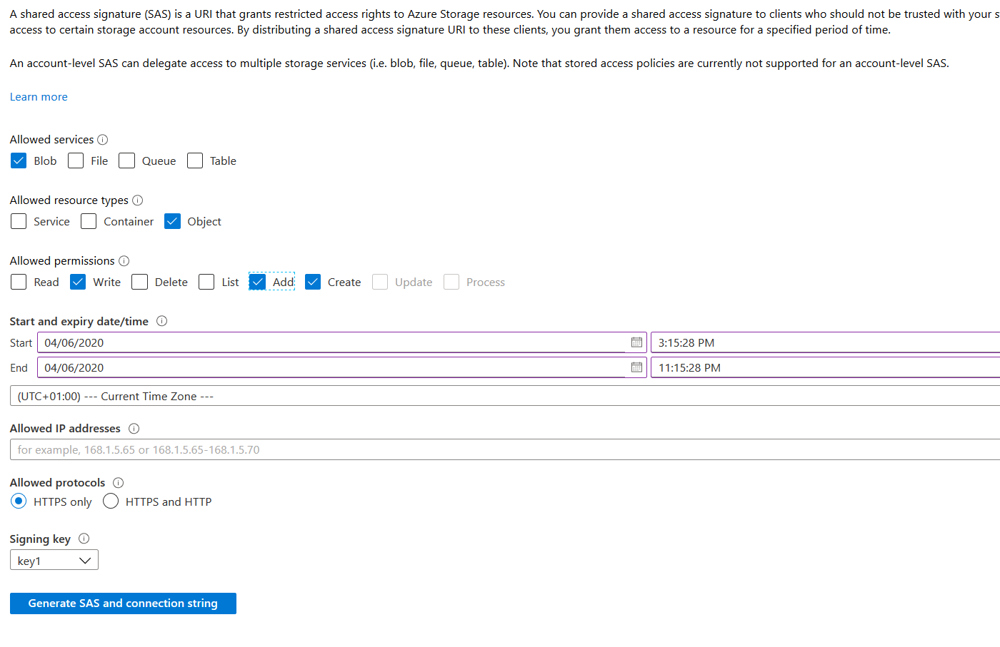

# Data Upload to Blob

**Produced by Dave Lusty**

## Introduction

This demo shows how to use HTML and Javascript to upload files to Azure. The site is hosted in a storage account to reduce costs since it requires no server side components. SAS keys can be used to control access via the URI. The upload happens through the storage SDK for Javascript (browser version) and so uses the API directly. For this reason there are no file size limits enforced from a server since there is "no server". The video is [not ready yet](https://youtu.be/H_IaqNDJ11c)

The site looks like the below image but has a basic CSS file included for you to modify. I'm not a web designer so it's pretty basic I'm afraid, but it is functional!

Special thanks on this demo goes to Joseph Zimmerman who posted [this excellent article](https://www.smashingmagazine.com/2018/01/drag-drop-file-uploader-vanilla-js/). I especially like this kind of post because it doesn't lazily use libraries and obfuscate the technology. HTML and Javascript are all you need here besides the storage SDK (which is much more complex under the hood!).

## Demo

For this demo, you'll need a storage account and the code from this repository. Once the storage account is deployed you'll need to set a few things up to get up and running.

### Static Website on Blob

First, you'll want to set up using your storage account as a static website. This allows you to browse it without a costly web server. To do this, click static website in the settings menu and then type index.html in the index document name and click save. This will allow you to use the generated url without the /index.html part on the end. It's not entirely necessary since here we'll be supplying whole urls to people for security purposes. 

Next, upload the files from the repository into the root of the new $web container that has been created for your site. You'll need to tell it to upload to a folder for the css, js and libs folders. **Please note that you'll need to download and extract the files from [here](https://aka.ms/downloadazurestoragejsblob) in the libs folder since I cannot republish them**. Once these are uploaded, create another container and call it "uploads". This container should be private since we don't want to give public access to the uploaded files.

### Set up CORS

In order for the scripting to work, you need to enable CORS on the storage account. Click on CORS under the settings menu and set up a rule. Your origin will be the full uri provided under the static website settings above. This includes the https:// part. Allow only PUT and then allow all headers and set the max age to something large. For production purposes you should carefully consider these settings, but the above are relatively locked down and we can be reasonably sure nothing odd will be hosted in your storage account's domain.

### Generate the SAS Key

Next, click on Shared access signature on the settings menu to generate your SAS key. In future demos we'll do this programatically in order to give time limited links to people, but for now we'll generate it manually.
Select only Blob under allowed services, and then Object for resource types. Give the key write, add and create permissions and set a start and end time. Choose HTTPS only and click generate SAS and connection string.

Copy the resulting SAS token from the "SAS Token" box.

### website

Once you've completed the above steps, create your link as per this formula:

`https://<url>/index.html<SASKey>&accountName=<accountname>&containerName=<containername>`

Please note that there is no extra ? before the SAS key since it includes one already. The URL comes from your static website settings and the accountname is your storage account name. Container name is uploads and is the container you created above. Next, browse to the URI you created and you should see a site like the below:

You can either click the button to browse for files, or you can drag them into the dashed box. Either way they will upload to your storage account.